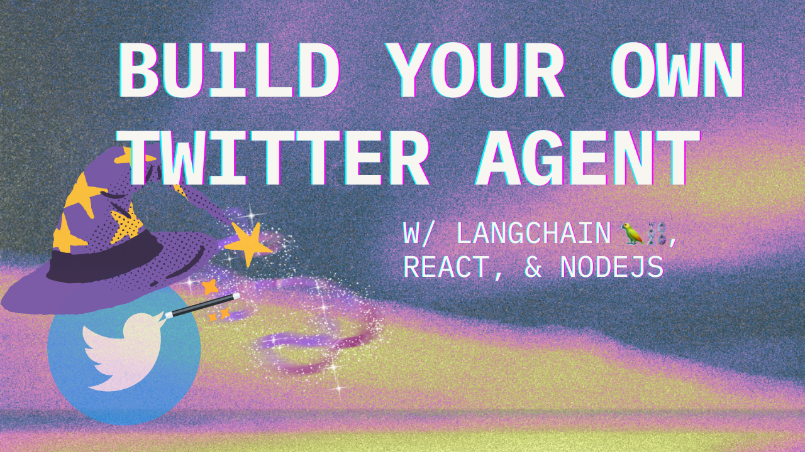

This is a companion repo to the tutorial [Build Your Own Personal Twitter Agent 🧠🐦⛓ with LangChain, React & NodeJS](https://wasp-lang.dev/blog/2023/06/27/build-your-own-twitter-agent-langchain)

If you have any questions, please join the [Wasp Discord Server](https://discord.gg/rzdnErX)